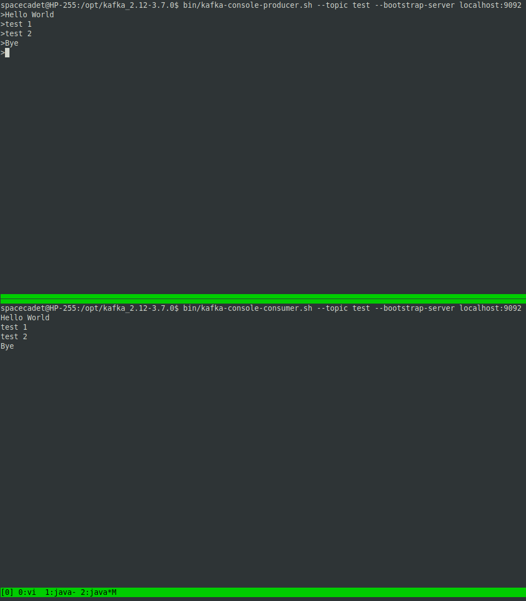

### Запуск Kafka

1. Установить jdk

```
sudo apt install openjdk-17-jdk
```

2. Скачать Kafka с сайта kafka.apache.org и развернуть на локальном диске

```
wget https://downloads.apache.org/kafka/3.7.0/kafka_2.12-3.7.0.tgz
tar xzvf kafka_2.12-3.7.0.tgz
cd kafka_2.12-3.7.0/
```

3. Запустить Zookeeper

```
bin/zookeeper-server-start.sh config/zookeeper.properties
```

4. Запустить Kafka Broker

```
bin/kafka-server-start.sh config/server.properties
```

5. Создать топик test

```
bin/kafka-topics.sh --create --topic test --bootstrap-server localhost:9092
```

6. Записать несколько сообщений в топик


```
bin/kafka-console-producer.sh --topic test --bootstrap-server localhost:9092
>Hello World
>test 1
>test 2
>Bye
```

7. Прочитать сообщения из топика

```
bin/kafka-console-consumer.sh --topic test --from-beginning --bootstrap-server localhost:9092
Hello World
test 1
test 2
Bye
```


